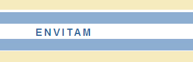



<!--
# {{ page.custom_page_title }}
-->

# Agriculture and geophysics: an electrical meeting!

Agrogeophysics is an emerging research field. What are the applications, potential and future research needs? Come and discover with us.

  

## Brussels, Belgium*
*and streamed online 

Want to join? [Register now](https://www.eventbrite.com/e/2nd-agrogeophysics-seminar-tickets-192657412507)

## About this event

_After the success of the first edition '*Geophysics & Agriculture: the perfect match?*' in 2020, we are pleased to give you all a new opportunity to exchange knowledge, good practices, and passion on current trending topics in agrogeophysics_.

<a class="btn btn-primary" href="/2nd_agrogeophysics_seminar/program" role="button">Read more</a>

## Key dates and registration

* **Registration** 
	- deadline: February 25th, 2022
	- fees: **20€** for Phds, **10€** for master students, **40€** for all other cases

* 🛬 **Arrival + conference dinner:** Thursday evening March 10th, 2022

* 📅 **Seminar day:** Friday March 11th, 2022 8:30 - 18:00

## Venue: [Palace of the Academies](https://www.kvab.be/en/palace-academies)

<figure>
	
    <figcaption> Rooms <b>Stevinzaal</b> for the seminar and <b>Troonzaal</b> for the posters/breaks. </figcaption>
</figure>

### How to get there
* **Contact**: [ https://www.kvab.be/en/contact]( https://www.kvab.be/en/contact)

<iframe src="https://www.google.com/maps/embed?pb=!1m19!1m8!1m3!1d10077.618771837862!2d4.3653797!3d50.8421898!3m2!1i1024!2i768!4f13.1!4m8!3e6!4m0!4m5!1s0x47c3c48409f9587f%3A0xb74dfdbd0226f3dd!2sPalais%20des%20Acad%C3%A9mies%20Rue%20Ducale%201%201000%20Bruxelles!3m2!1d50.8421898!2d4.3653797!5e0!3m2!1sfr!2sus!4v1644430361212!5m2!1sfr!2sus" width="600" height="450" style="border:0;" allowfullscreen="" loading="lazy"></iframe>

<!--
<iframe width="425" height="350" frameborder="0" scrolling="no" marginheight="0" marginwidth="0" src="https://www.openstreetmap.org/export/embed.html?bbox=4.362119436264039%2C50.84018189814839%2C4.368814229965211%2C50.84361336329293&amp;layer=transportmap&amp;marker=50.84189766226552%2C4.365466833114624" style="border: 1px solid black"></iframe> <small><a href="https://www.openstreetmap.org/?mlat=50.84190&amp;mlon=4.36547#map=18/50.84190/4.36547&amp;layers=T">Display map</a></small>
-->

## Contact

Interested in participating? Get in touch! Pick the option that works best
for you.

<ul class="fa-ul my-5">
<li>
<i class="fa-li fa fa-envelope-open fa-fw" aria-hidden="true"></i>
Email <a href="hello.agrogeophy@gmail.com">hello.agrogeophy@gmail.com</a> or another <a href="committees">committee member</a> directly.
</li>
<li>
<i class="fa-li fab fa-slack fa-fw" aria-hidden="true"></i>
Find us on the <a href="https://join.slack.com/t/agrogeophy/shared_invite/zt-14x7c3h5f-_MziokBFPOrrFk2z2rRBIw">Agrogeophy</a> Slack (if it is the first time use this invitation link).
</li>
</ul>

 

## Sponsors 🙌

The seminar is supported by

<ul>
  <li> The <a href="http://www.soilbelgium.be/"> Soil Science Society of Belgium (SSSB) </a> – Topical committee II.Soil physics and hydrology </li>
  <li> ENVITAM doctoral school </li>
</ul>

     

## Previous seminars

- 2020 <a href="http://www.soilbelgium.be/?p=3596">in Gembloux</a>
Geophysics conquering new territories: The rise of “agrogeophysics”
{{ macros.make_publication_list(page.papers) }}

## Collaborations

We're always interested in new collaborations and interesting projects.
We'd love to hear from you if your project or idea could benefit from our
expertise in monitoring, data analysis, inverse problems, and research software
engineering.

**Reach out** to [our team](committees) to start a conversation!

